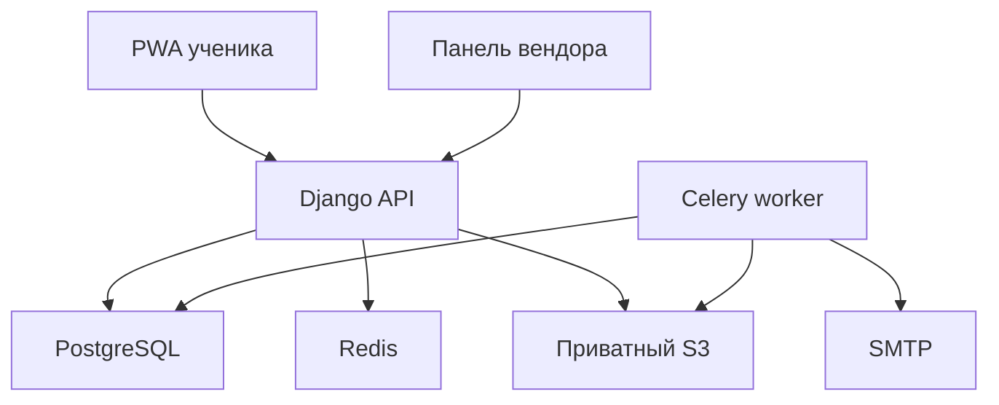

# Техническое задание: лёгкая обучающая PWA-платформа

## Этап 1 — рабочий прототип без оплат

**Статус:** готово к передаче в OpenCode  
**Дата:** 12 августа 2026  
**Язык интерфейса этапа 1:** русский  
**Главная цель:** проверить создание курсов, выдачу доступа по ссылке, правило одного активного устройства и полноценный офлайн-просмотр установленной PWA.

---

## 1. Инструкция OpenCode

Реализуй только этап 1 из этого документа. Не добавляй Prodamus, платежи, витрину, корзину и автоматическую выдачу доступа после покупки.

Работай последовательно по итерациям из раздела 18:

1. Перед началом проверь существующий репозиторий, `README`, `AGENTS.md`, состояние Git и текущие тесты. Не перезаписывай пользовательские изменения.
2. Для каждой итерации сначала составь короткий план и перечисли затрагиваемые файлы.
3. Реализуй итерацию полностью, включая миграции, тесты, документацию и проверку запуска.
4. После каждой итерации остановись и выдай:
   - что сделано;
   - какие файлы изменены;
   - какие команды проверки запущены и их результат;
   - как вручную проверить результат;
   - известные ограничения.
5. Не переходи к следующей итерации без явной команды пользователя.
6. Не заменяй рабочую логику моками. Моки допустимы только в автоматических тестах.
7. Не оставляй критичные `TODO`, пустые обработчики, фиктивную авторизацию или публичные S3-объекты.
8. Любое отступление от ТЗ сначала оформи коротким ADR в `docs/adr/` с причиной и последствиями.

---

## 2. Продуктовая модель

Платформа поддерживает иерархию:

```text
Вендор → Курсы → Модули → Уроки → Единицы контента
```

Типы единиц контента этапа 1:

- текст;
- видео;
- аудио;
- изображение.

Один ученик может иметь доступ к нескольким курсам одного вендора и после входа видит только доступные ему опубликованные курсы.

### 2.1. Что означает «одно устройство»

В браузере нельзя надёжно определить физический телефон или компьютер. Поэтому в рамках продукта **устройством считается одна установка PWA в одном профиле браузера**, имеющая собственную неэкспортируемую криптографическую пару ключей.

Следствия:

- несколько вкладок одного браузерного профиля считаются одним устройством;
- другой браузер, другой профиль браузера, очистка данных сайта или переустановка PWA считаются новым устройством;
- аппаратный fingerprinting не использовать;
- перенос доступа на новое устройство автоматически отзывает онлайн-сессию старого устройства.

Правило действует на весь AccessPass ученика внутри одного вендора, а не отдельно на каждый курс: при переносе на новое устройство вместе переносятся все доступные курсы этого вендора.

### 2.2. Честное ограничение офлайн-защиты

Если старое устройство находится без интернета, сервер не может мгновенно сообщить ему об отзыве. Уже скачанный курс остаётся доступен до окончания локальной офлайн-лицензии. Для этапа 1 срок лицензии — **24 часа с последней успешной онлайн-проверки**, значение должно настраиваться переменной окружения.

Абсолютно защитить видео в браузере невозможно: пользователь всегда может записать экран или модифицировать собственный браузер. Защита этапа 1 должна:

- не давать постоянных публичных ссылок на S3;
- мешать простой передаче ссылки другому человеку;
- не хранить офлайн-медиа открытыми файлами;
- быстро отзывать обычную онлайн-сессию;
- сдерживать бытовое копирование, но не называться DRM.

---

## 3. Границы этапа 1

### 3.1. Входит в этап

- многовендорная модель и изоляция данных вендоров;
- создание вендора платформенным администратором;
- вход владельца/редактора вендора по email и паролю;
- восстановление пароля администратора через email;
- лёгкая административная панель;
- CRUD курсов, модулей, уроков и единиц контента;
- ручная сортировка модулей, уроков и единиц контента;
- черновик, публикация и снятие курса с публикации;
- загрузка изображений, видео и аудио в приватное S3-совместимое хранилище;
- ручное создание ученика и выдача ему доступа к курсам;
- одна постоянная высокоэнтропийная ссылка доступа на ученика в рамках вендора;
- одна активная установка браузера на ссылку доступа;
- перенос сессии на новое устройство с отзывом старой;
- восстановление доступа ученика через письмо на подтверждённый email;
- клиентская PWA со списком доступных курсов и просмотром уроков;
- явная кнопка «Скачать курс»;
- офлайн-просмотр текста, изображений, аудио и видео;
- минимальный прогресс: последняя открытая единица, позиция аудио/видео, ручная отметка «Пройдено»;
- синхронизация накопленного офлайн-прогресса после возвращения сети;
- журнал ключевых действий безопасности;
- Docker Compose для локальной разработки;
- автоматические тесты и инструкция запуска.

### 3.2. Не входит в этап

- Prodamus и любые другие оплаты;
- цены, промокоды, корзина, заказы, чеки, возвраты;
- публичная витрина и продажа других курсов;
- самостоятельная регистрация вендоров;
- самостоятельная покупка/регистрация учеников;
- тесты, задания, сертификаты, комментарии, чаты;
- сложная аналитика и отчёты;
- мобильные приложения App Store/Google Play;
- полноценный DRM Widevine/FairPlay;
- адаптивный битрейт и обязательный транскодинг в несколько качеств;
- фоновое скачивание после закрытия PWA;
- одновременный доступ ученика к курсам разных вендоров в одной общей ссылке.

### 3.3. Задел на следующие этапы

- `Enrollment.source` должен иметь значение `manual` на этапе 1 и допускать будущие `payment`, `promo`, `import`;
- у `Enrollment` должно быть nullable-поле `source_reference` для будущего ID платежа/заказа;
- S3 реализовать через интерфейс хранилища, не привязывая доменную логику к AWS;
- создание доступа вынести в отдельный сервис `grant_course_access(...)`, чтобы позже его вызывал обработчик подтверждённой оплаты;
- платежные сущности и поля цены сейчас не создавать.

---

## 4. Рекомендуемый стек

### Backend

- Python 3.13;
- Django 5.2 LTS;
- Django REST Framework;
- PostgreSQL;
- Redis только для rate limit, короткого кеша сессий и блокировок; PostgreSQL остаётся источником истины;
- Celery + Redis для отправки писем и проверки загруженных медиа;
- `boto3` для S3-совместимого API;
- `ffprobe` для проверки метаданных видео/аудио;
- Argon2id для паролей администраторов;
- pytest, pytest-django, factory_boy;
- Ruff и mypy.

### Frontend

- React + TypeScript в строгом режиме;
- Vite;
- React Router;
- TanStack Query для серверного состояния;
- Dexie поверх IndexedDB для метаданных, очереди синхронизации и зашифрованных блоков медиа;
- Web Crypto API;
- `vite-plugin-pwa` в режиме `injectManifest` с собственным Service Worker;
- Vitest + Testing Library;
- Playwright для E2E.

### Инфраструктура

- Docker Compose: PostgreSQL, Redis, MinIO, Mailpit, backend, worker, frontend;
- production: HTTPS reverse proxy, PostgreSQL, Redis, приватный S3 и SMTP;
- один публичный origin предпочтителен: `/api/` и `/backoffice/` обслуживает backend, остальные маршруты — PWA;
- lock-файлы зависимостей обязательны.

Не заменять PostgreSQL на SQLite даже в разработке: конкурентный перенос активной сессии должен тестироваться на той же модели блокировок и ограничений, что и production.

---

## 5. Архитектура



### 5.1. Backend-модули

- `accounts` — пользователи, вход администраторов, восстановление;
- `vendors` — вендоры, участники, tenant-права;
- `learning` — курсы, модули, уроки, единицы контента;
- `media_assets` — S3, загрузка и проверка файлов;
- `access` — ученики, зачисления, ссылки, устройства, сессии, восстановление;
- `progress` — прогресс и идемпотентная синхронизация;
- `audit` — события безопасности и административные действия.

### 5.2. Правила слоёв

- View/API не содержит бизнес-логику переноса устройства, публикации и выдачи доступа;
- бизнес-операции находятся в сервисах приложения и выполняются транзакционно;
- доступ к моделям вендора всегда проходит через явный `vendor_id` из проверенного членства пользователя;
- объект из другого вендора должен возвращать `404`, а не раскрывающий существование `403`;
- исходные S3 credentials никогда не попадают во frontend;
- frontend не строит S3 URL из `object_key` самостоятельно.

---

## 6. Роли и права

| Действие | Platform Admin | Vendor Owner | Vendor Editor | Learner |
|---|---:|---:|---:|---:|
| Создать/заблокировать вендора | Да | Нет | Нет | Нет |
| Управлять участниками вендора | Да | Да | Нет | Нет |
| Управлять курсами своего вендора | Да | Да | Да | Нет |
| Загружать медиа своего вендора | Да | Да | Да | Нет |
| Управлять учениками и доступами | Да | Да | Нет | Нет |
| Просматривать курсы по Enrollment | Нет | Нет | Нет | Да |
| Перенести активное устройство | Нет | Через отзыв | Нет | По ссылке/восстановлению |
| Смотреть аудит своего вендора | Да | Да | Нет | Нет |

Platform Admin использует защищённую системную админку. Vendor Owner и Vendor Editor не должны видеть модели и данные других вендоров даже при ручной подмене URL/ID.

---

## 7. Модель данных

Во всех публичных сущностях использовать UUID. Все даты хранить в UTC. Email перед сохранением привести к нормализованному виду; сравнение email должно быть регистронезависимым.

### 7.1. Основные сущности

#### User

- `id: UUID`;
- `email` — глобально уникальный нормализованный email;
- `email_verified_at`;
- `password_hash` — nullable для учеников без пароля;
- `is_active`;
- `created_at`, `updated_at`, `last_login_at`.

#### Vendor

- `id: UUID`;
- `name`, `slug`;
- `status: active | suspended`;
- `created_at`, `updated_at`.

#### VendorMember

- `vendor_id`, `user_id`;
- `role: owner | editor`;
- уникальность пары `(vendor_id, user_id)`.

#### Course

- `id`, `vendor_id`;
- `title`, `slug`, `short_description`, `description_markdown`;
- `cover_asset_id` nullable;
- `status: draft | published | archived`;
- `offline_revision: integer`, начинается с 1;
- `current_revision_id` nullable;
- `published_at`;
- `created_at`, `updated_at`;
- уникальность `(vendor_id, slug)`.

`offline_revision` атомарно увеличивается при публикации изменений структуры, текста или медиа. Черновые изменения не должны ломать уже опубликованную версию до нажатия «Опубликовать».

#### CourseRevision

Неизменяемый опубликованный снимок курса. Клиентские API читают опубликованный снимок, а не редактируемые Module/Lesson/ContentUnit.

- `id`, `course_id`;
- `revision_number: positive integer`;
- `snapshot_json` — каноническая структура модулей, уроков, текста и ссылок на MediaAsset ID;
- `snapshot_sha256`;
- `created_by`, `created_at`;
- уникальность `(course_id, revision_number)`;
- связь с использованными MediaAsset через `CourseRevisionAsset(course_revision_id, media_asset_id)`.

Операция публикации в одной транзакции валидирует редактируемое дерево, создаёт CourseRevision, увеличивает `offline_revision` и переключает `current_revision_id`. Старые снимки неизменяемы. MediaAsset нельзя физически удалить, пока на него ссылается хотя бы один CourseRevision; допустимо пометить его архивным и удалить позже отдельной безопасной процедурой хранения.

#### Module

- `id`, `course_id`;
- `title`, `description`;
- `position: positive integer`;
- уникальность `(course_id, position)`.

#### Lesson

- `id`, `module_id`;
- `title`, `description`;
- `position`;
- `is_published`;
- уникальность `(module_id, position)`.

#### ContentUnit

- `id`, `lesson_id`;
- `type: text | video | audio | image`;
- `title` nullable;
- `position`;
- `text_markdown` nullable;
- `media_asset_id` nullable;
- `is_downloadable`, по умолчанию `true`;
- `created_at`, `updated_at`;
- уникальность `(lesson_id, position)`;
- CHECK: для `text` заполнен только `text_markdown`; для медиа-типа заполнен подходящий `media_asset_id`.

#### MediaAsset

- `id`, `vendor_id`;
- `kind: image | video | audio`;
- `status: pending | uploaded | validating | ready | rejected`;
- `bucket`, `object_key`;
- `original_name` — только для отображения, не часть ключа S3;
- `content_type`, `size_bytes`, `sha256`;
- `duration_seconds`, `width`, `height` nullable;
- `rejection_reason` nullable;
- `created_by`, `created_at`, `updated_at`.

#### Enrollment

- `id`, `vendor_id`, `user_id`, `course_id`;
- `status: active | revoked | expired`;
- `source: manual` на этапе 1;
- `source_reference` nullable;
- `starts_at`, `ends_at` nullable;
- `granted_by`, `created_at`, `revoked_at` nullable;
- уникальность активной пары `(user_id, course_id)`.

#### AccessPass

Одна ссылка для одного ученика в рамках одного вендора; открывает все его активные Enrollment этого вендора.

- `id`, `vendor_id`, `user_id`;
- `token_hash` — HMAC-SHA-256 от секрета с отдельным server-side pepper;
- `token_prefix` — первые безопасные символы для поиска в поддержке, не секрет;
- `generation: integer`;
- `status: active | revoked`;
- `created_at`, `rotated_at`, `last_used_at`;
- уникальность активной пары `(vendor_id, user_id)`.

Raw token никогда не хранить в базе, логах или аналитике. Он показывается владельцу вендора только сразу после создания/ротации.

#### Device

- `id`, `access_pass_id`;
- `installation_id: UUID`;
- `public_key_jwk`;
- `public_key_fingerprint`;
- `display_name` — например, «Chrome · Windows» без агрессивного fingerprinting;
- `first_seen_at`, `last_seen_at`, `revoked_at` nullable.

#### LearnerSession

- `id`, `access_pass_id`, `device_id`;
- `session_token_hash`;
- `pass_generation`;
- `created_at`, `last_seen_at`, `expires_at`, `revoked_at` nullable;
- `revoke_reason: replaced | manual | logout | expired` nullable.

В PostgreSQL создать частичное уникальное ограничение: у `AccessPass` не больше одной сессии с `revoked_at IS NULL`.

#### RecoveryChallenge

- `id`, `user_id`, `vendor_id`;
- `token_hash`;
- `expires_at`, `used_at` nullable;
- `requested_ip_hash`, `created_at`.

Токен одноразовый, срок жизни 15 минут.

#### OfflineLicense

- `id`, `device_id`, `course_id`;
- `course_revision`;
- `issued_at`, `expires_at`, `revoked_at` nullable;
- `license_id` входит в подписанный клиентский payload.

#### UnitProgress

- `id`, `user_id`, `content_unit_id`;
- `status: not_started | in_progress | completed`;
- `position_seconds` nullable;
- `updated_at`, `completed_at` nullable;
- уникальность `(user_id, content_unit_id)`.

#### ProgressEvent

- `event_id: UUID` — приходит с клиента и обеспечивает идемпотентность;
- `user_id`, `content_unit_id`, `event_type`, `payload`, `client_created_at`, `received_at`;
- уникальность `event_id`.

#### AuditEvent

- `id`, `vendor_id` nullable, `actor_user_id` nullable;
- `event_type`;
- `target_type`, `target_id`;
- `ip_hash`, `user_agent_summary`;
- `metadata` без токенов, cookies, email в открытом виде и подписанных S3 URL;
- `created_at`.

---

## 8. Административная панель

Для этапа 1 допустима аккуратно настроенная Django Admin по адресу `/backoffice/` с брендингом и tenant-фильтрацией. Отдельный React-backoffice не нужен.

### 8.1. Обязательные экраны

1. Вход по email и паролю.
2. Восстановление пароля.
3. Список курсов: статус, число модулей, дата изменения.
4. Карточка курса: название, описания, обложка, статус.
5. Модули курса с изменением порядка.
6. Уроки модуля с изменением порядка.
7. Единицы контента урока с изменением порядка и загрузкой медиа.
8. Предпросмотр опубликованного вида курса.
9. Список учеников.
10. Карточка ученика: email, доступные курсы, активное устройство, последняя активность.
11. Действия: выдать/отозвать курс, создать/ротировать ссылку, скопировать ссылку, отозвать устройство.
12. Краткий журнал безопасности вендора.

### 8.2. Правила редактирования

- позиционирование должно быть плотным: `1, 2, 3...`; перестановка выполняется транзакционно;
- нельзя опубликовать курс без хотя бы одного опубликованного урока и одной валидной единицы контента;
- нельзя привязать `pending/rejected` MediaAsset к публикуемому контенту;
- Markdown должен проходить серверную и клиентскую санитизацию; raw HTML запретить;
- удаление использованного MediaAsset запрещено; сначала убрать связи;
- удаление курса на этапе 1 заменить архивацией;
- каждое изменение прав, публикация, отзыв и ротация ссылки пишутся в AuditEvent.

---

## 9. Авторизация и восстановление

### 9.1. Администраторы вендора

- логин — подтверждённый email;
- пароль хранить через Argon2id;
- минимальная длина пароля 15 символов, разрешить пробелы и Unicode, не требовать искусственной комбинации регистров/символов;
- сессия — серверная, cookie `Secure`, `HttpOnly`, `SameSite=Lax`, `Path=/`;
- восстановление: одноразовый криптографически случайный URL-токен на 30 минут;
- форма восстановления всегда отвечает одинаково, существует email или нет;
- rate limit по IP и хешу email;
- после смены пароля отозвать остальные административные сессии;
- MFA не входит в этап 1, но обязательно отметить как требование перед production-запуском с реальными продажами.

### 9.2. Ученик: постоянная ссылка доступа

Формат письма/ссылки:

```text
https://app.example.com/activate#token=<256-bit-url-safe-secret>
```

Токен размещается во fragment, чтобы браузер не отправлял его reverse proxy и чтобы он не попадал в access log. После чтения token frontend немедленно очищает адрес через `history.replaceState` и передаёт токен только POST-запросом в body.

Токен:

- не менее 32 случайных байт из CSPRNG;
- хранится только в виде HMAC-хеша;
- не включается в query string, analytics, ошибки, breadcrumbs и логи;
- может быть отозван или ротирован владельцем вендора;
- постоянный и повторно используемый на этапе 1, потому что именно повторный переход должен переносить доступ на другое устройство;
- это осознанное прототипное отклонение от более безопасных одноразовых magic link.

### 9.3. Ключ установки

При первом запуске PWA:

1. генерирует `installation_id`;
2. через Web Crypto создаёт ECDSA P-256 key pair;
3. private key создаётся с `extractable=false` и хранится как `CryptoKey` в IndexedDB;
4. сервер получает public JWK и fingerprint;
5. при следующих входах устройство подписывает одноразовый server challenge.

Нельзя использовать canvas/font/IP fingerprint как идентификатор устройства.

### 9.4. Обмен ссылки на сессию

1. Frontend отправляет токен, `installation_id` и public key в `POST /api/v1/auth/access/inspect`.
2. Backend проверяет токен и возвращает одноразовый challenge и признак переноса.
3. Устройство подписывает challenge private key.
4. Если активного устройства нет или это то же устройство — backend создаёт/ротирует сессию.
5. Если активно другое устройство — API возвращает `409 DEVICE_TRANSFER_CONFIRMATION_REQUIRED`.
6. UI показывает: «Доступ уже открыт на другом устройстве. Продолжить здесь и завершить предыдущую сессию?»
7. После подтверждения backend в одной транзакции:
   - блокирует строку AccessPass через `SELECT ... FOR UPDATE`;
   - увеличивает `generation`;
   - отзывает старую LearnerSession и старый Device;
   - создаёт/активирует новый Device;
   - создаёт одну новую LearnerSession;
   - пишет AuditEvent.
8. Backend устанавливает opaque cookie `__Host-lms_session` со случайным значением не менее 32 байт. В БД хранится только его HMAC-хеш.

Не использовать долгоживущий JWT для клиентской сессии: серверная opaque-сессия проще и надёжнее отзывается немедленно.

### 9.5. Контроль старого устройства

- каждый API-запрос проверяет session hash, `revoked_at`, срок и совпадение `pass_generation`;
- во время открытого приложения frontend отправляет heartbeat каждые 10 секунд и сразу перед началом воспроизведения;
- при `401 SESSION_REPLACED` frontend останавливает плеер, очищает приватные runtime-данные и показывает отдельный экран;
- вкладки одной установки синхронизируют logout через `BroadcastChannel`;
- на сервере не должно быть окна, когда две активные сессии считаются валидными;
- уже выданный S3 presigned URL может жить до 60 секунд, а начатая загрузка — завершиться; это явное ограничение этапа 1.

### 9.6. Восстановление ученика

Экран «Получить новую ссылку» принимает email.

- ответ всегда одинаковый: «Если доступ существует, письмо отправлено»;
- запрос сам по себе не отзывает текущий доступ, иначе знание email позволит устроить DoS;
- письмо содержит одноразовый recovery token на 15 минут;
- только успешный обмен recovery token на новом устройстве ротирует постоянную ссылку, отзывает старую ссылку/сессию и активирует новое устройство;
- использованный/просроченный recovery token повторно не принимается;
- владелец вендора может вручную повторно выдать доступ после проверки личности вне системы.

---

## 10. Защита медиа и S3

### 10.1. Bucket

- bucket полностью приватный;
- Public Access Block/эквивалент включён;
- listing запрещён;
- backend/worker имеют минимальные IAM-права только на нужный bucket/prefix;
- server-side encryption включено: SSE-S3 для прототипа, SSE-KMS рекомендуется для production;
- CORS разрешает только production origin и локальный dev origin, только нужные методы/заголовки;
- ключи объектов случайны: `vendors/<vendor_uuid>/assets/<asset_uuid>/source`;
- оригинальное имя файла никогда не используется как путь;
- lifecycle должен удалять незавершённые загрузки и осиротевшие pending-объекты.

### 10.2. Загрузка

1. Backoffice запрашивает `POST /api/v1/backoffice/media/uploads`.
2. Backend проверяет роль, тип и заявленный размер, создаёт MediaAsset `pending`.
3. Backend возвращает presigned POST на 10 минут с фиксированным object key, allowlist Content-Type, `content-length-range` и checksum. Если конкретный S3-провайдер не поддерживает нужное условие checksum, целостность обязательно независимо проверяет worker.
4. Браузер загружает файл напрямую в S3 по выданной POST policy.
5. Backoffice вызывает `POST /api/v1/backoffice/media/{id}/complete`.
6. Worker делает HEAD, проверяет размер/checksum, magic bytes, allowlist расширения, `ffprobe`, длительность/разрешение.
7. Только после проверки статус становится `ready`.

Лимиты этапа 1, настраиваемые:

- изображение: 20 MiB, JPEG/PNG/WebP;
- аудио: 250 MiB, MP3/M4A/AAC/OGG;
- видео: 1 GiB, MP4 с H.264 + AAC для максимальной совместимости.

Не доверять `Content-Type` и расширению от браузера. SVG, HTML и исполняемые форматы запретить.

### 10.3. Онлайн-просмотр

- ученик запрашивает доступ к MediaAsset через авторизованный API;
- backend сначала проверяет Session → Enrollment → опубликованный Course → принадлежность MediaAsset;
- затем создаёт presigned GET не более чем на 60 секунд;
- Range-запросы должны работать;
- presigned GET задаёт `ResponseCacheControl=no-store` или эквивалент провайдера;
- URL не хранить в БД и не писать в логи;
- ответ API и маршрут получения URL — `Cache-Control: no-store`;
- при каждом новом запросе URL права проверяются заново;
- при `403` из-за истечения URL плеер запрашивает новый URL и продолжает с последней подтверждённой позиции;
- в плеере поверх видео показывать ненавязчивый динамический watermark: маскированный email + короткий session prefix, периодически меняющий позицию;
- запрет контекстного меню и атрибут `controlsList="nodownload"` допустимы только как UX-сдерживание, не как мера безопасности.

---

## 11. PWA и офлайн-курс

### 11.1. Общие требования

- корректный web manifest, иконки, `display: standalone`, theme/background colors;
- Service Worker работает только по HTTPS, кроме localhost;
- app shell открывается без сети;
- курс не скачивается скрытно: только после явного действия пользователя;
- перед скачиванием показывать размер, доступное место и срок офлайн-доступа;
- вызвать `navigator.storage.persist()` и корректно обработать отказ;
- предупредить, что браузер/ОС может удалить данные сайта;
- режим инкогнито не поддерживать для скачивания;
- скачивание этапа 1 продолжается только пока PWA открыта;
- прерванное скачивание можно продолжить по уже проверенным блокам.

### 11.2. Разделение хранилищ

| Данные | Хранилище | Стратегия |
|---|---|---|
| Версионированный app shell | Cache API | precache/cache-first |
| API, auth, signed URL | Не кешировать | network-only, `no-store` |
| Метаданные курса | IndexedDB | зашифрованный offline package |
| Медиа-блоки | IndexedDB | AES-256-GCM, блоки по 4 MiB |
| Ключ установки/локальный AES key | IndexedDB | `CryptoKey`, `extractable=false` |
| Очередь прогресса | IndexedDB | idempotent outbox |

Нельзя позволять Workbox автоматически кешировать ответы API или presigned S3 URL.

### 11.3. Скачивание курса

1. Клиент получает `offline-manifest` конкретной `course_revision`.
2. Manifest содержит структуру, текст, MediaAsset ID, тип, размер, SHA-256, число блоков и срок лицензии; не содержит постоянных S3 URL.
3. Сервер создаёт OfflineLicense, привязанную к активному Device, Course и revision, и возвращает подписанный ES256 JWS с claims `license_id`, `device_id`, `course_id`, `revision`, `iat`, `exp`. Приватный ключ подписи существует только на сервере; PWA содержит публичный ключ и проверяет подпись через Web Crypto.
4. Клиент проверяет доступное место через `navigator.storage.estimate()` с запасом минимум 15%.
5. Для каждого asset клиент получает короткий presigned URL, скачивает поток блоками по 4 MiB, проверяет checksum и немедленно шифрует блок AES-256-GCM.
6. Для каждого блока использовать уникальный 96-bit IV; в AAD включать `course_id`, `revision`, `asset_id`, `chunk_index`.
7. Открытый блок не сохранять в Cache API, localStorage или файловую систему пользователя.
8. Структуру курса и текст сериализовать отдельно и также шифровать AES-256-GCM; открытый manifest в IndexedDB не хранить.
9. В IndexedDB фиксировать прогресс только после успешной записи и проверки зашифрованного блока.
10. После завершения показать «Доступно офлайн до ...».

Локальная шифрация защищает от простого извлечения файлов из профиля браузера. Она не защищает от XSS, модифицированного браузера или захвата уже расшифрованного потока.

### 11.4. Офлайн-воспроизведение

- кастомный Service Worker перехватывает внутренний URL `/__offline_media/<asset_id>`;
- поддерживает HTTP Range и ответы `206 Partial Content`;
- определяет необходимые блоки, читает их из IndexedDB, расшифровывает в worker и отдаёт через `ReadableStream`;
- не создаёт целый расшифрованный видеофайл на диске;
- до выдачи проверяет локальную подпись/структуру лицензии, Device ID, course revision и срок;
- при истечении лицензии показывает «Подключитесь к интернету для продления доступа»;
- после успешного heartbeat лицензия может быть продлена сервером ещё на 24 часа;
- если Enrollment отозван или Session заменена, сервер лицензию не продлевает;
- при полученном отзыве приложение удаляет локальный AES key и пакет курса best-effort.

Проверка времени в пользовательском браузере не является защищёнными часами. Защита срока офлайн-лицензии на этапе 1 считается best-effort.

### 11.5. Обновление и удаление

- изменение опубликованного курса увеличивает `offline_revision`;
- UI показывает «Доступно обновление»;
- новая revision скачивается отдельно, после проверки старая атомарно удаляется;
- кнопка «Удалить с устройства» удаляет структуру, медиа-блоки, лицензию и локальный прогресс, уже синхронизированный с сервером;
- logout и `SESSION_REPLACED` удаляют все приватные пакеты данного AccessPass;
- очистка browser storage означает потерю скачанных курсов и превращает повторный вход в новое устройство.

---

## 12. Клиентский интерфейс

### 12.1. Экраны

1. Активация ссылки.
2. Подтверждение переноса устройства.
3. Ввод email для восстановления.
4. Сообщение «Проверьте почту» без раскрытия существования аккаунта.
5. Список доступных курсов.
6. Карточка курса с модулями, уроками, прогрессом и размером скачивания.
7. Просмотр урока и последовательных ContentUnit.
8. Плееры видео/аудио с сохранением позиции.
9. Менеджер скачивания: размер, проценты, пауза, продолжить, ошибка, удалить.
10. Индикатор online/offline и срок лицензии.
11. Экран «Сессия перенесена на другое устройство».
12. Пустой экран «Нет доступных курсов».

### 12.2. UX-правила

- mobile-first от ширины 360 px;
- явные состояния loading/error/empty/offline;
- курс, не скачанный полностью, не помечать доступным офлайн;
- при недостатке места объяснять необходимый и доступный объём;
- не обещать фоновую загрузку;
- при offline скрывать действия, требующие сети, но оставлять открываемыми скачанные курсы;
- не терять позицию плеера при переходе между online/offline URL;
- manual completion доступно для каждой единицы;
- интерфейс должен быть доступен с клавиатуры, иметь видимый focus и подписи элементов управления.

---

## 13. API этапа 1

Префикс: `/api/v1`. JSON — `application/json`. Ошибки имеют стабильный `code`, пользовательское `message`, `request_id`; stack trace и секреты клиенту не возвращаются.

### 13.1. Auth ученика

| Method | Path | Назначение |
|---|---|---|
| POST | `/auth/access/inspect` | Проверить access token, выдать challenge, сообщить о необходимости transfer |
| POST | `/auth/access/exchange` | Проверить подпись устройства, создать или перенести сессию |
| GET | `/auth/me` | Текущий ученик, вендор, устройство |
| POST | `/auth/heartbeat` | Проверить сессию и при условиях продлить offline license |
| POST | `/auth/logout` | Отозвать текущую сессию и очистить cookie |
| POST | `/auth/recovery/request` | Отправить одноразовую recovery link с одинаковым ответом |
| POST | `/auth/recovery/exchange` | Использовать recovery token и перенести доступ |

### 13.2. Курсы и прогресс

| Method | Path | Назначение |
|---|---|---|
| GET | `/courses` | Только опубликованные курсы с активным Enrollment |
| GET | `/courses/{course_id}` | Полная опубликованная структура курса |
| GET | `/courses/{course_id}/offline-manifest` | Manifest текущей revision и размер |
| POST | `/courses/{course_id}/offline-license` | Создать/обновить лицензию текущего Device |
| GET | `/media/{asset_id}/stream-url` | Короткий presigned GET после проверки прав |
| GET | `/progress` | Прогресс доступных курсов |
| POST | `/progress/events:batch` | Идемпотентная пачка offline/online событий |

### 13.3. Backoffice media

| Method | Path | Назначение |
|---|---|---|
| POST | `/backoffice/media/uploads` | Создать MediaAsset и получить presigned POST policy |
| POST | `/backoffice/media/{asset_id}/complete` | Запустить серверную валидацию |
| GET | `/backoffice/media/{asset_id}` | Получить статус проверки |

CRUD основных моделей может выполняться стандартными Django Admin views. Если добавляется REST CRUD, он обязан иметь те же tenant-проверки и тесты.

### 13.4. Стандартные коды ошибок

- `AUTH_REQUIRED`;
- `INVALID_ACCESS_LINK`;
- `DEVICE_TRANSFER_CONFIRMATION_REQUIRED`;
- `DEVICE_PROOF_INVALID`;
- `SESSION_REPLACED`;
- `SESSION_EXPIRED`;
- `ENROLLMENT_REQUIRED`;
- `COURSE_NOT_PUBLISHED`;
- `OFFLINE_LICENSE_EXPIRED`;
- `OFFLINE_REVISION_OUTDATED`;
- `MEDIA_NOT_READY`;
- `STORAGE_QUOTA_INSUFFICIENT`;
- `RATE_LIMITED`;
- `VALIDATION_ERROR`.

---

## 14. Безопасность

### 14.1. Обязательные меры

- только HTTPS в production, HSTS;
- cookies с префиксом `__Host-`, `Secure`, `HttpOnly`, `SameSite=Lax`, без `Domain`;
- CSRF-защита всех изменяющих запросов с cookie-auth;
- строгий CORS allowlist;
- CSP без inline/eval и без сторонних скриптов; минимум: `default-src 'self'; object-src 'none'; base-uri 'none'; frame-ancestors 'none'` плюс точечные `connect-src`, `img-src`, `media-src`;
- `Referrer-Policy: no-referrer` на activation/recovery и `strict-origin-when-cross-origin` на остальных страницах;
- `X-Content-Type-Options: nosniff`;
- защита от clickjacking через CSP `frame-ancestors 'none'`;
- raw HTML в уроках запрещён, Markdown санитизируется;
- ORM и параметризованные запросы;
- tenant authorization на сервере для каждого объекта;
- UUID вместо последовательных публичных ID;
- секреты только через environment/secret manager;
- access/recovery/session токены не логировать;
- подписанные S3 URL редактировать из логов;
- чувствительные endpoints rate-limited;
- structured audit logs с `request_id`;
- production debug выключен;
- зависимости проверяются на известные уязвимости в CI;
- резервные копии PostgreSQL и проверяемое восстановление описаны в runbook.

### 14.2. Rate limits по умолчанию

- recovery request: 5/час на IP и 3/час на hash(email);
- access inspect/exchange: 20/мин на IP, затем progressive delay;
- admin login: 10/15 минут на IP+email;
- media URL: 120/мин на активную сессию;
- heartbeat: не чаще одного раза в 5 секунд.

Значения настраиваются. Ограничение не должно раскрывать наличие email.

### 14.3. Модель угроз

| Угроза | Мера этапа 1 | Остаточный риск |
|---|---|---|
| Утечка постоянной ссылки | 256-bit token, HMAC в БД, fragment URL, ротация, аудит | Владелец ссылки может перенести сессию себе |
| Копирование S3 URL | Приватный bucket, авторизация, TTL ≤ 60 секунд | Уже начатая загрузка может завершиться |
| Два устройства онлайн | Транзакция, generation, unique active session, heartbeat | До 10 секунд для остановки честного UI |
| Старое устройство offline | 24-часовая offline license | Мгновенный отзыв технически невозможен |
| Кража cookie | HttpOnly/Secure/SameSite, opaque token, device proof | Активный XSS может действовать в origin |
| XSS через текст/имя файла | Запрет raw HTML, санитизация, CSP, безопасный filename | Ошибка в собственном frontend-коде |
| Извлечение offline-файлов | AES-GCM blocks, non-extractable key | DevTools/модифицированный браузер может получить plaintext |
| Запись экрана | Динамический watermark | Полностью предотвратить нельзя |
| Подмена vendor/course ID | Серверная tenant-проверка и 404 | Ошибка в новом endpoint без общего policy слоя |

---

## 15. Нефункциональные требования

### Совместимость

- последние две основные версии Chrome/Edge/Firefox desktop;
- актуальные Chrome Android и Safari iOS;
- feature detection для Web Crypto, IndexedDB, Service Worker, Storage API;
- если безопасный offline-механизм не поддержан, онлайн-просмотр работает, а кнопка скачивания показывает понятное объяснение.

### Производительность прототипа

- список курсов: p95 API < 500 ms без учёта сети при 100 одновременных пользователях;
- heartbeat: p95 < 250 ms;
- UI не загружает весь курс-медиа заранее;
- изображения имеют размеры/превью, не отдавать оригинал обложки в списке;
- пагинация backoffice при более 50 объектах.

### Надёжность

- все выдачи/отзывы/переносы доступа транзакционны;
- повтор `ProgressEvent.event_id` не меняет результат дважды;
- прерванное скачивание возобновляется;
- ошибка одного asset не помечает весь курс скачанным;
- миграции применяются на пустую и заполненную тестовую БД;
- время сервера синхронизировано, все сравнения сроков выполняются сервером при наличии сети.

---

## 16. Структура репозитория

```text
/
├── apps/
│   ├── api/
│   │   ├── config/
│   │   ├── accounts/
│   │   ├── vendors/
│   │   ├── learning/
│   │   ├── media_assets/
│   │   ├── access/
│   │   ├── progress/
│   │   ├── audit/
│   │   └── manage.py
│   └── web/
│       ├── src/
│       │   ├── app/
│       │   ├── features/
│       │   ├── offline/
│       │   ├── security/
│       │   └── sw.ts
│       └── package.json
├── infra/
│   ├── docker/
│   └── proxy/
├── docs/
│   ├── adr/
│   ├── security-model.md
│   ├── offline-design.md
│   └── runbook.md
├── tests/e2e/
├── compose.yaml
├── .env.example
├── Makefile
└── README.md
```

### Обязательные переменные окружения

```text
APP_BASE_URL
DJANGO_SECRET_KEY
ACCESS_TOKEN_PEPPER
SESSION_TOKEN_PEPPER
DATABASE_URL
REDIS_URL
S3_ENDPOINT_URL
S3_REGION
S3_BUCKET
S3_ACCESS_KEY_ID
S3_SECRET_ACCESS_KEY
S3_USE_SSL
SMTP_HOST
SMTP_PORT
SMTP_USERNAME
SMTP_PASSWORD
SMTP_FROM_EMAIL
OFFLINE_LICENSE_SIGNING_PRIVATE_KEY
OFFLINE_LICENSE_SIGNING_PUBLIC_KEY
OFFLINE_LICENSE_TTL_HOURS=24
MEDIA_GET_URL_TTL_SECONDS=60
MEDIA_UPLOAD_URL_TTL_SECONDS=600
```

`.env.example` содержит только безопасные примеры. Реальные секреты запрещено коммитить.

---

## 17. Тестирование

### 17.1. Backend

- unit-тесты всех сервисов выдачи/отзыва/переноса;
- интеграционный тест двух конкурентных transfer-запросов: валидной остаётся ровно одна сессия;
- tenant isolation для каждой admin/API модели;
- token hash/rotation/expiry/single-use recovery;
- одинаковые recovery responses для существующего и несуществующего email;
- CSRF, cookie attributes, CORS и security headers;
- права на media URL;
- запрет pending/rejected media в опубликованном курсе;
- идемпотентность progress batch;
- публикация и increment `offline_revision`;
- audit без raw token и presigned URL.

### 17.2. Frontend

- activation и экран подтверждения transfer;
- обработка `SESSION_REPLACED`;
- фильтрация состояний online/offline;
- размер/место/ошибки download manager;
- возобновление блоков;
- AES-GCM encrypt/decrypt и отказ при изменённом ciphertext/AAD;
- очередь progress outbox;
- санитизация Markdown;
- Service Worker Range: полный файл, начало, середина, конец, некорректный range.

### 17.3. E2E Playwright

Использовать два независимых BrowserContext как два устройства.

1. Owner создаёт курс, модуль, урок и четыре типа контента.
2. Owner публикует курс и выдаёт его ученику.
3. Device A открывает ссылку и видит курс.
4. Device B открывает ту же ссылку, подтверждает перенос.
5. Следующий API-запрос Device A получает `SESSION_REPLACED`.
6. Не позднее 10 секунд Device A останавливает воспроизведение и показывает экран отзыва.
7. Device B скачивает курс, сеть отключается средствами Playwright, все типы контента открываются.
8. Прогресс создаётся offline, после возврата сети синхронизируется один раз.
9. Отозванный Enrollment не получает новую offline license.
10. Пользователь другого вендора не может получить course/media по UUID.

Отдельно выполнить ручную проверку установленной PWA на Android Chrome и iOS Safari: автоматический браузерный тест не заменяет проверку поведения storage/media на реальном устройстве.

---

## 18. Итерации реализации

### Итерация 1.1 — фундамент и tenant-модель

Сделать:

- monorepo, Docker Compose, healthchecks;
- Django/React skeleton;
- PostgreSQL, Redis, MinIO, Mailpit;
- User, Vendor, VendorMember;
- email/password login владельца, reset password;
- базовый `/backoffice/`;
- tenant policy/queryset слой;
- CI: lint, typecheck, unit tests;
- README с одной последовательностью запуска.

Готово, если:

- проект поднимается одной документированной командой;
- platform admin создаёт двух вендоров и владельцев;
- владельцы не видят данные друг друга;
- reset-письмо видно в Mailpit и токен одноразовый.

### Итерация 1.2 — курсы и приватные медиа

Сделать:

- Course, CourseRevision, Module, Lesson, ContentUnit, MediaAsset;
- CRUD, сортировку, preview/publish/archive;
- прямую загрузку по presigned POST в MinIO/S3 и серверную валидацию;
- короткие авторизованные stream URL;
- Course revision;
- тесты публикации, tenant isolation и upload security.

Готово, если:

- вендор создаёт курс из всех четырёх типов контента;
- неопубликованный курс недоступен клиентскому API;
- прямой анонимный запрос объекта к S3 получает отказ;
- готовое видео воспроизводится через короткий URL;
- другой вендор не может увидеть asset даже по известному UUID.

### Итерация 1.3 — ученик и одно активное устройство

Сделать:

- Enrollment, AccessPass, Device, LearnerSession, RecoveryChallenge, AuditEvent;
- создание ученика/доступа в backoffice;
- activation link во fragment;
- Web Crypto device proof;
- transactional session transfer;
- heartbeat, BroadcastChannel и экран `SESSION_REPLACED`;
- recovery по email;
- PWA: список курсов и online lesson viewer;
- прогресс online.

Готово, если:

- одна ссылка показывает несколько выданных курсов своего вендора;
- второй BrowserContext переносит доступ;
- старая сессия сразу не проходит ни один API endpoint;
- честный старый UI останавливается максимум за 10 секунд;
- два конкурентных переноса не создают две активные сессии;
- recovery не позволяет определить наличие email.

### Итерация 1.4 — зашифрованный offline package

Сделать:

- web manifest и custom Service Worker;
- offline manifest/license;
- оценку quota и запрос persistent storage;
- блочную загрузку, checksum, AES-GCM, resume;
- IndexedDB schema и migrations;
- Range playback через внутренний Service Worker URL;
- download manager, update/delete package;
- offline progress outbox и синхронизацию;
- очистку на logout/session replacement.

Готово, если:

- после полного скачивания и отключения сети весь курс открывается;
- открытые медиа не лежат в Cache API/IndexedDB;
- изменение ciphertext приводит к безопасной ошибке, а не воспроизведению;
- Range playback работает без сборки полного видео на диске;
- незавершённое скачивание продолжается;
- после 24 часов без проверки курс требует интернет;
- отзыв онлайн не продлевает старую лицензию.

### Итерация 1.5 — hardening и приёмка

Сделать:

- security headers/CSP/CSRF/CORS/rate limits;
- редактирование секретов из логов;
- полный E2E suite;
- backup/restore runbook;
- production compose/deployment guide без реальных секретов;
- ручной чек-лист Android/iOS;
- dependency audit и финальную документацию ограничений.

Готово, если выполнены все критерии раздела 19 и все автоматические проверки зелёные.

---

## 19. Критерии приёмки этапа 1

1. Platform Admin создаёт вендора и владельца.
2. Владелец входит по email, может восстановить пароль и видит только свой tenant.
3. Владелец создаёт, сортирует, публикует и архивирует курс.
4. Курс содержит текст, изображение, аудио и видео.
5. S3 bucket не имеет публичного чтения; медиа выдаётся только после проверки Enrollment.
6. Владелец создаёт ученика, выдаёт несколько курсов и получает одну ссылку.
7. Ученик открывает ссылку и видит только выданные опубликованные курсы.
8. На Device B та же ссылка требует подтверждения и переносит доступ.
9. Device A после переноса получает `SESSION_REPLACED` на любой API-запрос и останавливает UI максимум за 10 секунд.
10. В БД невозможно иметь две активные LearnerSession одного AccessPass.
11. Ученик может восстановить доступ через email; токен одноразовый и истекает.
12. Ученик скачивает курс, отключает сеть, перезапускает PWA и открывает все типы контента.
13. Офлайн-медиа хранится только зашифрованными блоками.
14. Истёкшая offline license блокирует курс до подключения к серверу.
15. Офлайн-прогресс синхронизируется без дублей.
16. Изменение опубликованного курса создаёт новую revision и предлагает обновление пакета.
17. Очистка данных сайта не ломает аккаунт: повторная активация считается переносом на новое устройство.
18. Нет raw access/recovery/session tokens, паролей, S3 credentials и presigned URL в логах.
19. Все backend/frontend/E2E тесты проходят из чистого checkout.
20. README позволяет новому разработчику поднять прототип без устных пояснений.

---

## 20. Definition of Done для любого изменения

- код реализован, а не замокан;
- миграция создана и проверена;
- tenant/auth проверки находятся на сервере;
- happy path и негативные сценарии покрыты тестами;
- линтер, typecheck и тесты зелёные;
- ошибка имеет стабильный code и безопасное сообщение;
- секреты/PII не попали в логи;
- документация и `.env.example` обновлены;
- UI имеет loading/error/empty/offline состояния;
- изменение не расширяет этап до платежей или витрины;
- OpenCode приложил точные команды ручной проверки.

---

## 21. Ссылки на технические основания

- [MDN: кеширование PWA](https://developer.mozilla.org/en-US/docs/Web/Progressive_web_apps/Guides/Caching)
- [MDN: Web Crypto API](https://developer.mozilla.org/en-US/docs/Web/API/Web_Crypto_API)
- [MDN: IndexedDB](https://developer.mozilla.org/en-US/docs/Web/API/IndexedDB_API)
- [MDN: storage quotas и eviction](https://developer.mozilla.org/en-US/docs/Web/API/Storage_API/Storage_quotas_and_eviction_criteria)
- [OWASP: Authentication Cheat Sheet](https://cheatsheetseries.owasp.org/cheatsheets/Authentication_Cheat_Sheet.html)
- [OWASP: Session Management Cheat Sheet](https://cheatsheetseries.owasp.org/cheatsheets/Session_Management_Cheat_Sheet.html)
- [OWASP: Forgot Password Cheat Sheet](https://cheatsheetseries.owasp.org/cheatsheets/Forgot_Password_Cheat_Sheet.html)
- [OWASP: File Upload Cheat Sheet](https://cheatsheetseries.owasp.org/cheatsheets/File_Upload_Cheat_Sheet.html)
- [AWS: presigned URLs](https://docs.aws.amazon.com/AmazonS3/latest/userguide/using-presigned-url.html)

---

## 22. Финальное ограничение перед production

Этап 1 — технически честный прототип, но не финальная коммерческая защита контента. Перед подключением оплат необходимо отдельно провести threat-model review, внешний security review, тест восстановления резервной копии, включить MFA для владельцев и принять решение: достаточно ли текущего уровня защиты или дорогие курсы требуют специализированного видеосервиса/CDN с DRM.
